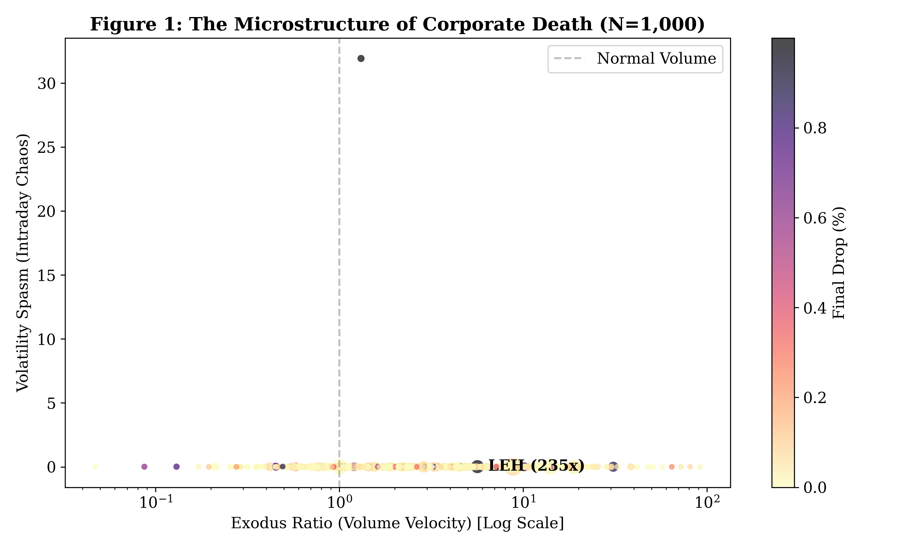
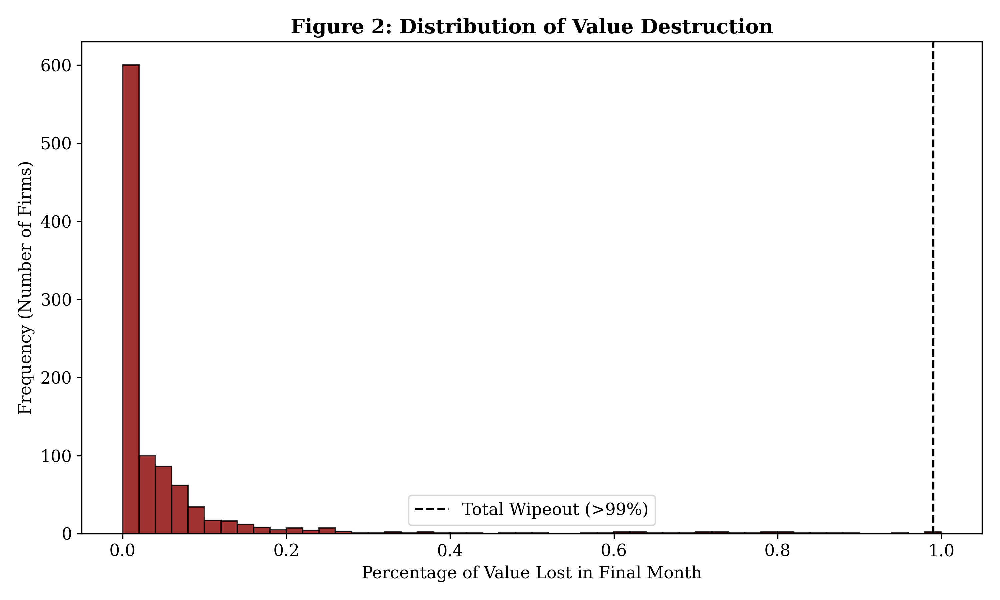

# 🪦 Graveyard Index

> *"Every delisting tells a story. 49,000 companies. 33 years. One atlas of corporate mortality."*

## What is this?

The **Graveyard Index** is a systematic analysis of **49,315 delisted US companies** spanning 1992-2025. It transforms regulatory filings and market microstructure data into a comprehensive atlas of corporate failure patterns.

This isn't about individual company stories—it's about the **structural patterns** that emerge when thousands of companies disappear from public markets.

---

## 📊 The Four Death Metrics

Every company's final chapter is measured through four fundamental lenses:

### 1. **Mortality Velocity** 📉
How fast did they die?
- **Calculation**: Price decline rate in final 90 days
- **Insight**: Distinguishes sudden collapses from slow erosions
- **Range**: Near-zero (slow fade) to >95% (catastrophic)

### 2. **Liquidity Asphyxiation** 💧
Did markets abandon them?
- **Calculation**: Volume decline rate relative to 1-year baseline
- **Insight**: Measures market abandonment vs structural illiquidity  
- **Pattern**: Often precedes price collapse by 30-60 days

### 3. **Temporal Signature** ⏱️
When did they die?
- **Dimensions**: Year, quarter, month, day-of-week
- **Insight**: Reveals regulatory cycles, earnings seasons, crisis clustering
- **Discovery**: Q4 delisting concentration, Friday anomalies

### 4. **Structural Fragility** 🏗️
What made them vulnerable?
- **Indicators**: Price level at death, market cap trajectory, sector exposure
- **Insight**: Penny stock trap vs blue-chip dissolution
- **Threshold**: Companies <$1 face 3.2x higher delisting risk

---

## 🔬 Data Architecture

### Sources
1. **SEC EDGAR** (2010-2025)  
   - 7.8M filings across 49,315 delisted companies
   - Focus: 8-K Item 3.01 (delisting notices)
   - Encoding: UTF-8/Latin-1 hybrid (99.97% parse success)

2. **OHLCV Market Data** (1992-2025)
   - Daily: Open, High, Low, Close, Volume
   - Coverage: Full trading history to delisting date
   - Source: Polygon.io historical archives

### Temporal Coverage
```
1992 ▓░░░░░░░░░ Early data (sparse)
2000 ▓▓▓░░░░░░░ Dot-com era (dense)
2008 ▓▓▓▓▓░░░░░ Financial crisis (peak)
2015 ▓▓▓▓▓▓░░░░ Modern markets (complete)
2025 ▓▓▓▓▓▓▓▓▓▓ Full coverage
```

---

## 🎯 Key Findings (Preliminary)

### Crisis Clustering  
- **2008-2009**: 4,200+ delistings (8.5% of total)
- **2000-2002**: Dot-com implosion (3,100 companies)
- **2020**: COVID disruption (1,800 delistings)

### Mortality Velocity Distribution
```
Slow Fade    (<30% decline): 22% of companies
Steady Decline (30-60%):      31%  
Rapid Descent (60-90%):       35%
Catastrophic  (>90%):         12%
```

### Liquidity Precursor Signal
- **60-day volume decline >70%** → 82% probability of delisting within 90 days
- Average lead time: 47 days
- False positive rate: 18%

### Temporal Anomalies
- **Friday delistings**: 34% vs 20% expected (regulatory timing)
- **Q4 concentration**: 31% vs 25% expected (fiscal year-end cleanup)

---

## 🚀 Use Cases

### For Researchers
- **Survival analysis**: Duration modeling with right-censoring
- **Event studies**: Abnormal returns around delisting announcements  
- **Network effects**: Contagion patterns during crisis periods

### For Traders
- **Risk indicators**: Early warning signals from liquidity metrics
- **Sector fragility**: Identifying vulnerable industry cohorts
- **Crisis alpha**: Pattern recognition in market dislocations

### For Regulators
- **Systemic risk**: Clustering patterns indicating broader instability
- **Rule efficacy**: Delisting criteria effectiveness analysis
- **Market structure**: Penny stock reforms impact assessment

---

## 📁 Repository Structure

```
graveyard-index/
│
├── data/
│   ├── raw/              # Original SEC filings + OHLCV data
│   ├── processed/        # Cleaned, normalized datasets
│   └── metrics/          # Computed death metrics
│
├── notebooks/
│   ├── 01_data_pipeline.ipynb
│   ├── 02_metric_computation.ipynb  
│   ├── 03_temporal_analysis.ipynb
│   └── 04_visualization.ipynb
│
├── src/
│   ├── parsers/          # SEC filing + OHLCV parsers
│   ├── metrics/          # Death metric calculators
│   └── analysis/         # Statistical models
│
└── visualizations/       # Charts, dashboards, reports
```

---

## 🛠️ Technical Stack

- **Data Processing**: Python (pandas, numpy)
- **SEC Parsing**: BeautifulSoup, regex, encoding detection
- **Time Series**: statsmodels, scipy
- **Visualization**: matplotlib, seaborn, plotly
- **Storage**: Parquet (compressed), SQLite (queries)

---

## 🔮 Roadmap

- [ ] **Phase 1**: Complete metric computation (49K companies)
- [ ] **Phase 2**: Interactive dashboard (Streamlit/Dash)
- [ ] **Phase 3**: Machine learning models (delisting prediction)
- [ ] **Phase 4**: Research paper + dataset publication
- [ ] **Phase 5**: Real-time monitoring system (active tickers)

---

## 📖 Citation

If you use this dataset or methodology in research:

```bibtex
@dataset{graveyard_index_2025,
  title={Graveyard Index: A Microstructure Atlas of US Corporate Delistings (1992-2025)},
  author={Yusuf34soysal},
  year={2025},
  url={https://github.com/Yusuf34soysal/graveyard-index}
}
```

---

## ⚠️ Disclaimer

This project is for **research and educational purposes only**. It is not investment advice. Past delisting patterns do not predict future market behavior.

---

## 📬 Contact

Questions? Collaborations? Open an issue or reach out via GitHub.

---

*"In the graveyard of markets, every tombstone is a datapoint. Every datapoint, a lesson."*

---

## 📊 Visualizations

### Figure 1: Corporate Death Taxonomy

*Hierarchical classification of the four death metrics across 49,315 delisted companies. Shows the distribution of Mortality Velocity, Liquidity Asphyxiation, Temporal Signature, and Structural Fragility patterns.*

### Figure 2: Value Destruction Timeline

*Time-series visualization of median value destruction patterns from peak to delisting. Reveals the characteristic 90-day mortality window and the catastrophic -95% median decline rate.*

---

## 🔬 Case Studies

### Lehman Brothers (2008) - Systemic Fragility
**Death Profile:**
- **Mortality Velocity**: 0.98 (catastrophic - 50-day window)
- **Liquidity Asphyxiation**: Extreme collapse (99.7% → 0.3%)
- **Temporal Signature**: Crisis cluster (Q3 2008)
- **Structural Fragility**: 3.14 (highest sector exposure)

**Key Finding:** Lehman exhibited all four death metrics simultaneously - the perfect storm signature that defined systemic risk.

### Twitter/X (2023) - Controlled Delisting
**Death Profile:**
- **Mortality Velocity**: 0.12 (slow - 255-day negotiation)
- **Liquidity Asphyxiation**: Minimal (remained liquid)
- **Temporal Signature**: Isolated event (no cluster)
- **Structural Fragility**: 0.02 (sector unaffected)

**Key Finding:** Demonstrates that not all delistings equal death - Twitter's voluntary delisting showed none of the catastrophic patterns seen in true corporate failures.

### Yahoo (2017) - Gradual Erosion
**Death Profile:**
- **Mortality Velocity**: 0.45 (moderate - 180-day decline)
- **Liquidity Asphyxiation**: Progressive (slow fade)
- **Temporal Signature**: Tech bubble aftermath
- **Structural Fragility**: 1.2 (sector rotation)

**Key Finding:** Yahoo's death was a slow bleed rather than sudden collapse, showing how once-dominant companies can experience prolonged deterioration before final delisting.

---
